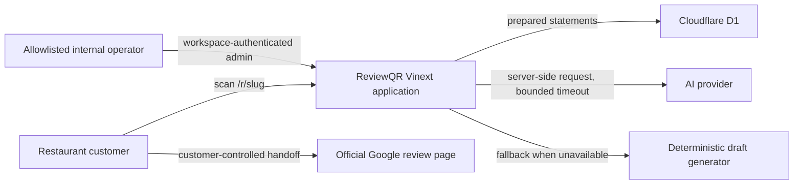

# ReviewQR MVP Architecture

**Status:** Proposed for Product Manager gate review
**Scope:** PRD stages 1–5; this document does not authorize deployment

## 1. Architectural outcome

Build ReviewQR as a Cloudflare-hosted, Vinext/Next-compatible **modular monolith**. One Worker serves server-rendered pages and route handlers; one D1 database stores restaurant configuration, anonymous sessions, and privacy-minimal funnel events. Draft generation is behind an application port with a deterministic fallback. R2, merchant accounts, billing, Google OAuth, and historical-review ingestion remain out of scope.

This shape minimizes operational complexity while preserving seams that can be split only after measured load or organizational ownership demands it.

## 2. Context and containers

Logical containers inside the Worker:

- `app/`: server pages and thin HTTP route handlers.
- `src/contracts/`: request/response shapes shared across UI and handlers.
- `src/domain/`: product vocabulary and invariants with no framework dependency.
- `src/application/`: use cases and ports; orchestration and policy decisions.
- `src/infrastructure/`: D1 repositories, AI provider, clock/ID adapters, and platform-specific rate limiting.
- `src/security/`: admin authorization, Google destination validation, redaction, and CSRF/origin checks.
- `db/` and `drizzle/`: schema and generated, committed migrations.

Dependencies point inward: `app → application → domain`; infrastructure implements application ports. Route handlers must not query D1 or call an AI SDK directly.

## 3. Planned route surface

### Browser routes

| Route | Access | Responsibility |
|---|---|---|
| `/` | Public | Minimal product/demo entry; no analytics claims |
| `/r/[slug]` | Public | Active restaurant customer flow; friendly unavailable state otherwise |
| `/admin` | Admin | Restaurant list and aggregate overview |
| `/admin/restaurants/new` | Admin | Five-minute onboarding form |
| `/admin/restaurants/[id]` | Admin | Edit, activate/deactivate, preview, QR, aggregate counts |

Admin pages are dynamic server-rendered pages. They read the trusted `oai-authenticated-user-email` header and enforce the same explicit allowlist as admin APIs. UI visibility is never treated as authorization.

### HTTP APIs

All JSON responses use `application/json`. Errors use `{ "error": { "code", "message", "retryAfterSeconds?" } }`. Unknown fields are rejected for write contracts. Mutations accept an `Idempotency-Key` header where noted.

| Method and route | Access | Contract and status |
|---|---|---|
| `GET /api/public/restaurants/[slug]` | Public | `200 PublicRestaurantResponse`; creates/refreshes opaque session cookie and dedupes `qr_page_viewed`; `404` unknown/inactive, `503` D1 failure |
| `POST /api/public/restaurants/[publicId]/drafts` | Public | `GenerateDraftRequest` → `200 GenerateDraftResponse`; validates active restaurant/rating/1–3 owned active topics/detail limit; `429` preserves own-writing path |
| `POST /api/public/restaurants/[publicId]/events` | Public | `RecordEventRequest` → `202` or duplicate `200`; allowlisted metadata only; analytics failure is non-blocking to UI |
| `POST /api/public/restaurants/[publicId]/handoffs` | Public | Validates active stored destination, records `google_handoff_clicked`, returns `200 { destination }`; the client navigates only to this returned allowlisted URL |
| `GET /api/admin/restaurants` | Admin | List internal restaurant summaries |
| `POST /api/admin/restaurants` | Admin | Create restaurant/topics atomically; idempotency required; `201` |
| `GET /api/admin/restaurants/[id]` | Admin | Full operator configuration |
| `PATCH /api/admin/restaurants/[id]` | Admin | Update mutable fields/topics/status; public ID remains immutable |
| `GET /api/admin/restaurants/[id]/qr.svg` | Admin | Deterministic QR for canonical `/r/{slug}`; attachment response |
| `GET /api/admin/restaurants/[id]/analytics` | Admin | Aggregate event counts and rating distribution, never customer rows |

The active public configuration omits the raw Google URL. The handoff endpoint returns only the currently stored URL after validation; it never accepts a destination from the client. Clipboard copying occurs locally before the handoff call. If navigation is blocked, the returned official link remains visible with the draft.

## 4. Core request flows

### Scan and draft

1. Server resolves normalized slug to an active restaurant; inactive and unknown share the same public response.
2. An opaque random session identifier is issued in a `Secure`, `HttpOnly`, `SameSite=Lax` cookie scoped to the public flow. No Google identity or contact information is requested.
3. `qr_page_viewed` uses a server-computed 30-minute dedupe key. An event write failure does not fabricate success and should not prevent rendering after the restaurant read succeeds.
4. The customer selects any 1–5 rating and 1–3 active topics, or chooses own-writing.
5. Generation validates all identifiers server-side, loads approved facts, consumes a per-session/restaurant fixed-window quota, then calls the AI adapter with an abort deadline shorter than eight seconds.
6. Provider absence, timeout, error, or malformed/policy-invalid output records a classified failure best-effort and returns deterministic fallback text from the same inputs.
7. Draft text and optional detail exist only in request/browser memory. Events contain source, rating, identifiers/count, edited flag, and length bucket—never text.

### Handoff

1. The browser validates 10–1,000 characters for the combined copy action.
2. It attempts clipboard copy and retains the editor text regardless of outcome.
3. It posts session/rating/copy outcome to the handoff endpoint.
4. The server re-loads the active restaurant, validates its stored Google destination, records the event best-effort, and returns that destination.
5. The browser opens/navigates to Google and explains that the customer must paste, review, and press **Post**. `I posted it` creates only `completion_self_reported`.

### Admin mutation

1. Trusted workspace identity header must exist and normalized email must match a server-side allowlist.
2. Mutation requires JSON content type, same-origin `Origin`/`Host`, strict validation, and an idempotency key.
3. Google URL must use HTTPS and match a narrow Google-owned host/path validator. Resolve no client-provided redirect.
4. Restaurant plus 3–8 topics are written in one D1 batch/transactional unit. Repeat idempotency keys replay the reference rather than duplicate data.

## 5. Data design

- `restaurants`: internal ID, immutable random public ID, unique mutable-friendly slug, identity, validated Google URL, JSON approved facts, status, timestamps.
- `topics`: restaurant-owned ordered active choices with display label and safe prompt descriptor.
- `review_sessions`: opaque identifiers and activity timestamps only.
- `analytics_events`: append-only event name, optional rating, allowlisted JSON metadata, optional unique dedupe key, timestamp.
- `operation_keys`: scoped idempotency keys with expiry and response reference.
- `rate_limit_buckets`: short-lived fixed-window counters keyed by opaque session/restaurant/action; no raw IP.

D1 schema lives in `db/schema.ts`; generated SQL lives in `drizzle/`. All runtime queries use Drizzle or one-statement prepared statements through repository adapters. Schema changes require generated migration inspection. Cleanup jobs may remove event rows after 90 days and expired operation/rate rows; exact scheduling is a pre-pilot operational decision.

JSON fields are parsed through explicit runtime validators. `metadata_json` is assembled server-side from an event-specific allowlist; the generic client object is never serialized directly.

## 6. Security and privacy model

- Public inputs: normalize slug; validate rating, UUID/opaque IDs, topic ownership/count, text length, enum values, and request size.
- Destination: allow HTTPS only and exact approved Google hosts/path patterns; reject credentials, control characters, lookalike suffixes, and client-supplied destinations. Revalidate on every admin save and handoff.
- Admin: platform workspace header establishes identity; explicit `ADMIN_EMAIL_ALLOWLIST` establishes authorization. Production fails closed when either is missing. A loopback-only, environment-gated development identity may be implemented for tests and never defaults on.
- CSRF: same-origin checks for admin mutations plus `SameSite` cookies/platform session; APIs do not trust a client-supplied email header outside the trusted hosting boundary.
- Rate limiting: D1 fixed-window counters per opaque session + restaurant for generation/event abuse, conservative request-size limits, and optional platform/WAF limits later. Rate limiting never blocks own-writing or direct handoff.
- Logging: structured event names, status, latency bucket, provider class, and request correlation ID. Draft/detail bodies, cookies, raw IP, user agent, clipboard data, Google URL query data, and secrets are redacted or omitted.
- Secrets: AI credential and admin allowlist are server-only runtime configuration; no `NEXT_PUBLIC_` secret keys.
- Output: React encoding by default; no untrusted HTML rendering; secure headers and CSP are defined before pilot release.

## 7. AI boundary and fallback

`DraftGenerator` accepts only restaurant name, rating, selected topic descriptors, approved facts, and optional request-scoped customer detail. The provider prompt requires 25–60 words, rating-appropriate sentiment, no invented entities/circumstances, and plain review text. A `DraftPolicy` rejects empty, oversized, malformed, or clearly unsupported responses.

Provider timeout target is 5 seconds, leaving budget for validation and fallback inside the 8-second product limit. The deterministic generator is always configured and builds restrained sentences from the same rating/topics; it is not merely an error message. The application records provider source separately and returns the same response shape. Provider SDK/types stay in infrastructure so switching vendors does not change domain/UI contracts.

## 8. Observability

- Use a request correlation ID that is never a customer identity.
- Structured operational logs: route, status, latency bucket, safe error class, AI provider/source; no request bodies on draft/event routes.
- Product analytics remain D1 events defined in the PRD, not third-party tracking.
- Initial health signals: public read error rate, usable draft rate including fallback, AI failure/latency buckets, handoff endpoint error rate, admin auth denials, and D1 write failures.
- Alerts/deployment dashboards are deferred, but log/event contracts must make them possible without schema redesign.

## 9. Decisions and tradeoffs

### ADR-001 — Modular monolith

**Decision:** one Vinext Worker with inward module dependencies.
**Why:** smallest reliable operating unit for an MVP and five-person staged delivery.
**Tradeoff:** less independent scaling; split AI generation only if latency/load data justifies it.

### ADR-002 — D1 and raw/Drizzle prepared access

**Decision:** D1 `DB`, no R2; repositories hide persistence.
**Why:** relational configuration, dedupe, and aggregates fit SQLite semantics.
**Tradeoff:** design writes to tolerate D1 contention and batch related mutations.

### ADR-003 — Stable app URL, mutable destination

**Decision:** QR encodes canonical ReviewQR slug URL; Google destination is server-owned.
**Why:** printed artifacts survive edits and cannot become arbitrary redirectors.
**Tradeoff:** ReviewQR availability is required at scan time.

### ADR-004 — Anonymous ReviewQR sessions

**Decision:** random opaque cookie/session, no customer account or IP storage.
**Why:** sufficient for funnel dedupe and lowest privacy risk.
**Tradeoff:** users can reset sessions and cross-device attribution is intentionally impossible.

### ADR-005 — No draft persistence

**Decision:** draft and customer detail remain ephemeral.
**Why:** matches product need and privacy contract.
**Tradeoff:** returning later/on another device cannot restore a draft.

### ADR-006 — Platform identity plus allowlist

**Decision:** trusted workspace identity header plus explicit server-side email allowlist; no app auth stack.
**Why:** internal-only operator scope and Sites capability.
**Tradeoff:** authorization depends on correct hosting access policy and runtime configuration.

### ADR-007 — Honest, equal Google handoff

**Decision:** every rating receives identical actions; ReviewQR returns an official destination but never posts/verifies.
**Why:** product policy and technical reality.
**Tradeoff:** true Google publication conversion is unobservable.

## 10. Delivery boundaries and ownership

- UI engineer: `/r/[slug]`, admin pages, accessible interactions, clipboard/navigation fallbacks, QR presentation.
- Backend engineer: route handlers, application use cases, D1 repositories/fixtures, authorization, validators, AI/fallback, aggregates.
- Shared contracts: `src/domain`, `src/contracts`, and application ports; changes require Software Development Manager review.
- QA: black-box API/browser verification against `docs/TEST_STRATEGY.md` and PRD matrix.

Integration order is Stage 2 foundation → Stage 3 customer/draft → Stage 4 admin/QR/analytics → Stage 5 E2E QA. Each gate must pass before the next begins; no deployment is part of this plan.

## 11. Known pre-implementation risks

1. Exact Google-owned URL patterns must be captured as test fixtures from operator-supplied official links; allowlisting whole `google.com` is too broad.
2. Vinext route-handler/runtime compatibility should be proven with a minimal D1 integration test in Stage 2 before UI work depends on it.
3. Sites workspace-header trust is valid only behind the hosting boundary; local test bypass must remain explicit and fail closed.
4. D1-based rate limiting is an MVP control, not full bot mitigation; production pilot may need platform/WAF rules.
5. Browser clipboard/pop-up behavior varies; UI must keep text and a direct official link available.
